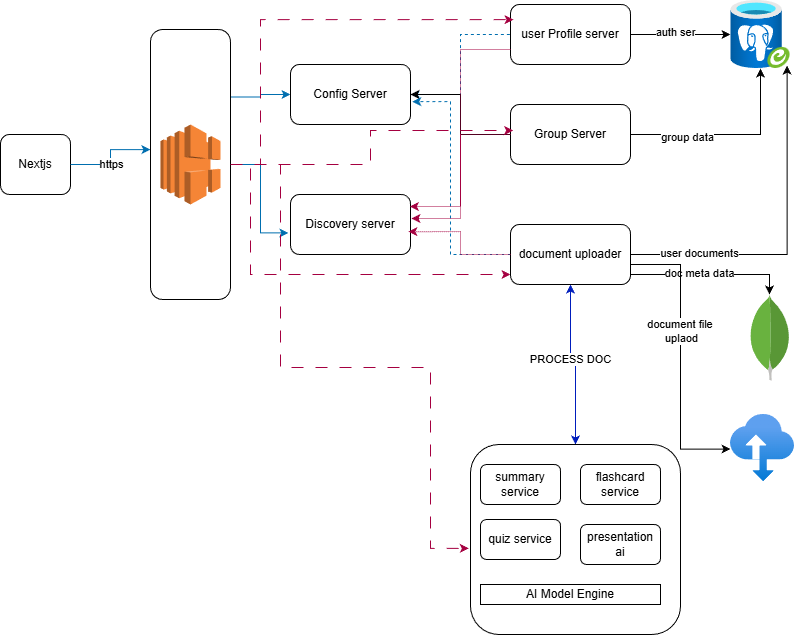

# Study-Sync-Arch

# Server

here we are using spring boot and python for handling backend task

spring boot is use for handling the authentication, and serives tasks

python is use for handling LLMs intrigation and doing task for servies

spring boot is a microservice architecutre, basically dividing things into different project, each will have its own project, this helps us to work on different part without worring about other stuff, and helps use to concentrate in one part, which we think can faster out project speed.

we have planned to use rest api serive for talking with python application

they both share the same database
